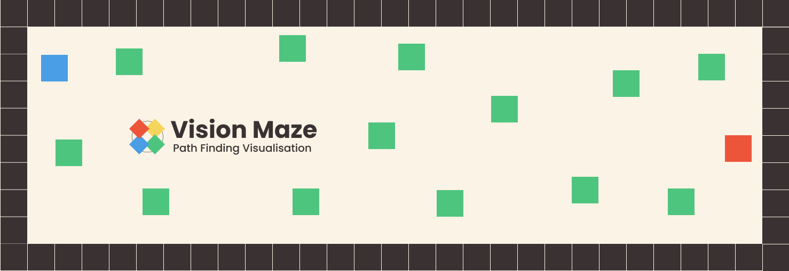

<div id="top"></div>

<div align="center">

# Vison Maze

 <p align="center">
   <a href="https://github.com/Delvoid/vision-maze/">Demo</a>
   ·
   <a href="https://github.com/Delvoid/vision-maze/issues">Report Bug</a>
   ·
   <a href="https://github.com/Delvoid/vision-maze/issues">Request Feature</a>
  </p>

</div>




Generate and visualize different maze generation and path finding algorithms. Built using TypeScript and React.


### Features

- Generate mazes using various algorithms:
   - Prim's algorithm
   - Recursive backtracking
   - Kruskal's algorithm
   - Recursive division
- Solve mazes using different path finding algorithms:
   - Breadth-first search (BFS)
   - Depth-first search (DFS)
   - A\* search
   - Dijkstra's algorithm
- Visualize the maze generation and path finding process 
- Create your own maze by left clicking and dragging on the grid
- Move the start and end points by dragging them


### Maze Generation Algorithms

#### Prim's Algorithm
Prim's is a greedy algorithm that efficiently creates mazes by considering the local optimum at each step. The resulting mazes often have numerous dead-ends.

#### Recursive Backtracking
A randomized depth-first search approach, this method creates mazes with long, winding passages.

#### Kruskal's Algorithm
An algorithm that produces mazes with a balanced texture, combining both randomness and structure in its approach.

#### Recursive Division
A recursive algorithm that works by splitting the maze into smaller sub-mazes. This method creates mazes with long, straight passages.


### Path Finding Algorithms

#### Breadth-first Search (BFS)
Breadth-first search is a graph traversal algorithm that explores nodes in the order of their distance from the root node. It finds the shortest path between the start and end points.

#### Depth-first Search (DFS)
Depth-first search is a graph traversal algorithm that explores nodes in the order of their depth from the root node. It does not guarantee the shortest path.

#### A\* Search
A\* search is a graph traversal algorithm that finds the shortest path between the start and end points. It uses a heuristic function to estimate the distance between the current node and the end node.

#### Dijkstra's Algorithm
Dijkstra's algorithm is a graph traversal algorithm that finds the shortest path between the start and end points. It does not use a heuristic function.


### Run Locally

1. Clone the project

```bash
  git clone
```

2. Go to the project directory

```bash
  cd vision-maze
```

3. Install dependencies

```bash
  npm install
```

4. Start the server

```bash
  npm run dev
```

or try the demo [here](https://delvoid.github.io/vision-maze/)

<p align="right">(<a href="#top">back to top</a>)</p>

### Contributions

Contributions are welcome! Feel free to open an issue or submit a pull request.

## Contact

Delvoid - [@delvoid](https://twitter.com/delvoid)

<p align="right">(<a href="#top">back to top</a>)</p>
